# Hi, I'm Michael Constantino 👋

### Software Engineer · Fullstack Developer

I build scalable web and mobile applications with a strong focus on clean architecture, type-safety, developer experience, and practical software that solves real problems.

[LinkedIn](https://www.linkedin.com/in/mich-constantino/) · [Portfolio](https://www.michaelconstantino.dev/) · [GitHub](https://github.com/MJayConstantino) · [Email](mailto:mjconstantino12345@gmail.com)

---

## About Me

I'm a Software Engineering student at **Central Philippine University** with experience building fullstack products, mobile apps, internal tools, and client-facing systems across academic, startup, freelance, and hackathon environments.

Most of my work revolves around **TypeScript**, **React**, **Next.js**, **Node.js**, **NestJS**, **PostgreSQL**, **Supabase**, and **React Native / Expo**. I enjoy working across the stack, from designing clean user interfaces to building secure APIs, database schemas, authentication flows, and deployment pipelines.

I care about writing maintainable code, collaborating in agile teams, and shipping products that are actually useful to people.

---

## What I Do

- Build fullstack web applications using **Next.js, React, TypeScript, and Node.js**
- Develop mobile applications with **React Native and Expo**
- Design backend systems with **NestJS, Express, PostgreSQL, Prisma, and Supabase**
- Implement authentication, role-based access control, and database security rules
- Create reusable UI components, test flows, and developer-friendly project structures
- Lead and collaborate in agile teams as a developer and Scrum Master

---

## Tech Stack

### Core

### Backend & Database

### Tools & Testing

---

## Featured Work

### DALI Portal

A legislative document tracking and public portal system built to digitize government-related workflows, including document management, internal dashboards, role-based access, and public access to legislative records.

**Role:** Scrum Master & Fullstack Developer
**Stack:** Next.js, NestJS, Supabase, PostgreSQL, Authentication, RBAC, RLS

### Notetube

An AI-powered learning platform that turns uploaded notes and PDFs into related YouTube suggestions and flashcards.

**Role:** Fullstack Developer / Team Lead
**Stack:** React, Node.js, PDF processing, flashcard generation, responsive UI

### React Native / Expo Mobile Work

Built and integrated production-facing mobile features using React Native and Expo, including reusable components, authentication-aware flows, and third-party SDK integrations.

---

## Currently Learning & Exploring

- DevOps, VPS self-hosting, Docker, and CI/CD
- Scalable backend architecture with NestJS and PostgreSQL
- Mobile app architecture with Expo development builds
- AI-assisted product features and local-first app ideas

---

## GitHub Activity & Stats

An overview of my top languages, lines of code, and contributions.

  

---

## Let's Connect

I'm always interested in learning, building useful products, collaborating with teams, and taking on projects that challenge me to grow as a software engineer.

[LinkedIn](https://www.linkedin.com/in/mich-constantino/) · [Portfolio](https://www.michaelconstantino.dev/) · [Email](mailto:mjconstantino12345@gmail.com)

